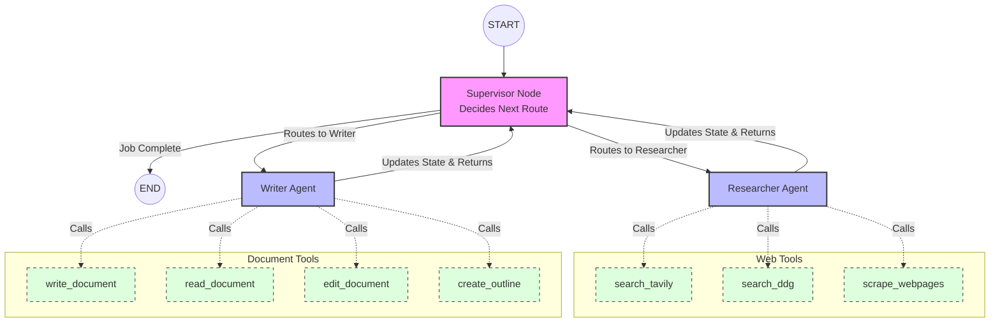

# LangGraph Architecture Diagram

This file visualizes how the nodes communicate, how the state updates, and which tools are connected to which agents.

If you are using a Markdown previewer that supports Mermaid (like VS Code or GitHub), this block will render as a flowchart!

## How the Flow Works
1. Execution starts at **START** and flows immediately to the **Supervisor**.
2. The **Supervisor** reads the `MessagesState` array. It uses its LLM strictly to decide if it should call the Researcher or the Writer.
3. If it calls the **Researcher Agent**, that agent is given a specific internal prompt and uses its **Web Tools** to fetch data.
4. Once the Researcher finishes, it appends its results to the global `MessagesState` array and returns control back to the **Supervisor**.
5. The **Supervisor** reads the new state. It sees the research is done, so it routes to the **Writer Agent**.
6. The Writer Agent uses its **Document Tools** (which are protected by atomic locks) to create files. It appends its final message to the state and returns control.
7. The **Supervisor** sees the final documents are written and routes to **END**, finishing the application.
