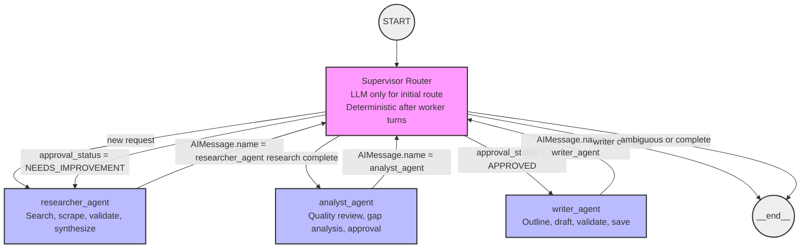
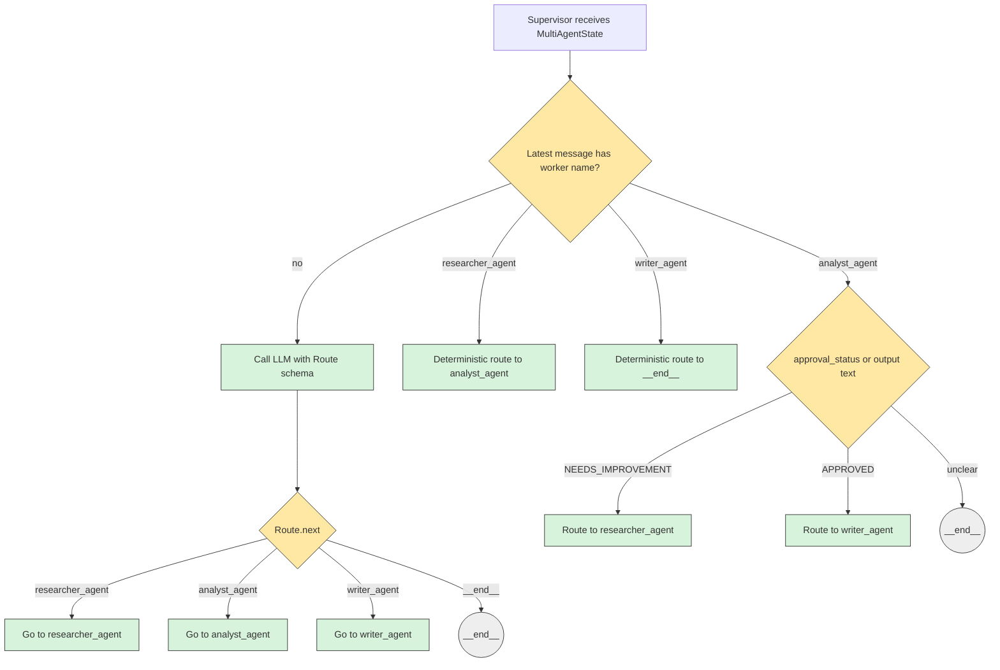
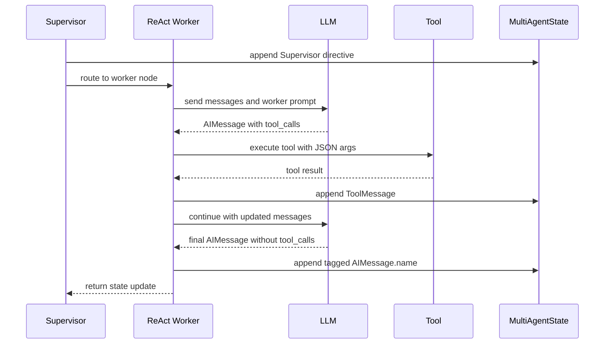
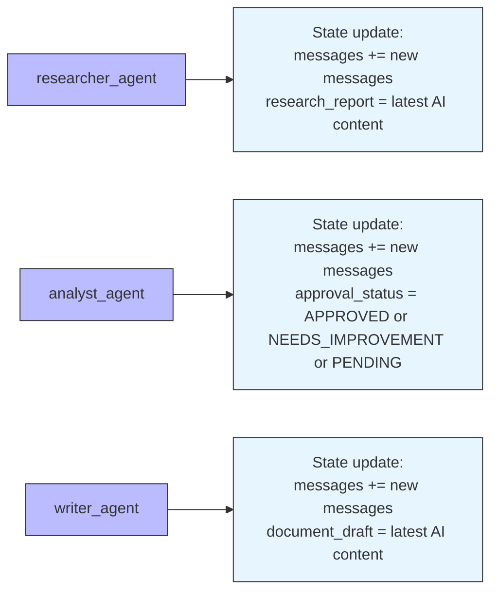
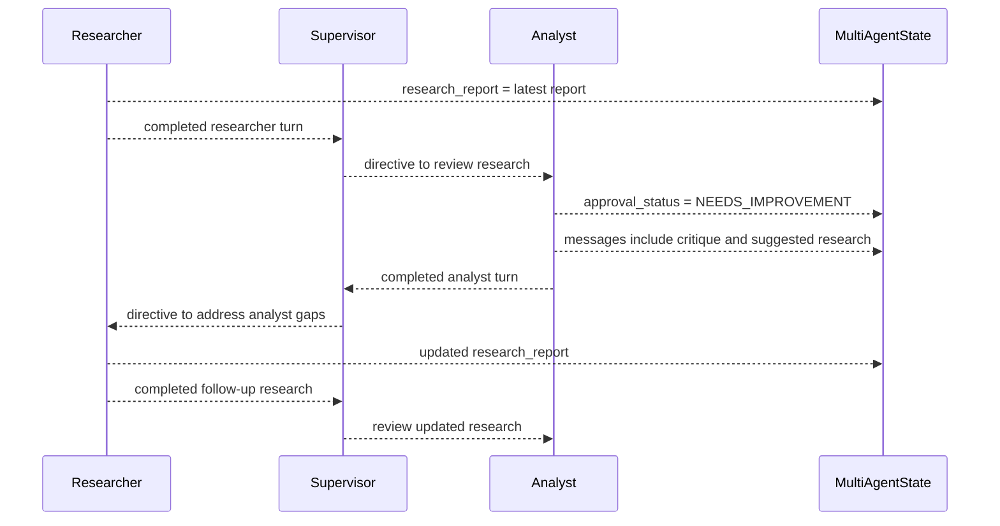
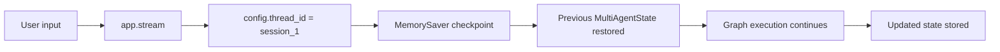

# LangGraph Architecture Diagrams

This file documents the graph routing, worker/tool loop, state updates, and expected response contracts. Markdown previewers with Mermaid support, such as GitHub or VS Code, will render these diagrams.

## 1. Graph Routing



## 2. Supervisor Decision Model



Initial LLM route schema:

```json
{
  "reason": "Brief explanation of why this route was selected.",
  "next": "researcher_agent | analyst_agent | writer_agent | __end__"
}
```

Deterministic routing after workers:

| Latest worker | Required signal | Next |
| --- | --- | --- |
| `researcher_agent` | any completed researcher turn | `analyst_agent` |
| `analyst_agent` | `NEEDS_IMPROVEMENT` | `researcher_agent` |
| `analyst_agent` | `APPROVED` | `writer_agent` |
| `writer_agent` | any completed writer turn | `__end__` |

## 3. ReAct Worker Tool Loop

Each worker is a ReAct agent. It can call tools repeatedly before returning control to the supervisor.



Tool call message shape:

```python
AIMessage(
    content="I will use search_github because...",
    tool_calls=[
        {
            "name": "search_github",
            "args": {"query": "LangGraph checkpointing"},
            "id": "call_..."
        }
    ]
)
```

Tool result shape:

```python
ToolMessage(
    name="search_github",
    tool_call_id="call_...",
    content="..."
)
```

Worker completion shape:

```python
AIMessage(
    name="researcher_agent",
    content="I have completed the research report..."
)
```

## 4. Worker State Updates



`MultiAgentState` fields:

```python
class MultiAgentState(TypedDict):
    messages: Annotated[list, add_messages]
    research_report: str
    scraped_data: str
    document_draft: str
    approval_status: str
```

## 5. Worker and Tool Map

```mermaid
flowchart TD
    classDef worker fill:#bbf,stroke:#333,stroke-width:2px
    classDef tool fill:#dfd,stroke:#333,stroke-dasharray: 5 5

    Researcher["researcher_agent"]:::worker
    Analyst["analyst_agent"]:::worker
    Writer["writer_agent"]:::worker

    subgraph Research_Tools["Research tools"]
        RT1["create_research_strategy"]:::tool
        RT2["validate_research_sources"]:::tool
        RT3["create_research_report"]:::tool
        RT4["analyze_research_completeness"]:::tool
    end

    subgraph Web_Tools["Web and reference tools"]
        W1["search_tavily"]:::tool
        W2["search_ddg"]:::tool
        W3["scrape_webpages"]:::tool
        W4["enhanced_search_tavily"]:::tool
        W5["search_wikipedia"]:::tool
        W6["search_arxiv"]:::tool
        W7["search_github"]:::tool
        W8["search_stackoverflow"]:::tool
        W9["get_tool_references"]:::tool
    end

    subgraph Document_Tools["Document tools"]
        D1["create_structured_document"]:::tool
        D2["generate_research_summary"]:::tool
        D3["validate_document_structure"]:::tool
        D4["create_outline"]:::tool
        D5["read_document"]:::tool
        D6["write_document"]:::tool
        D7["edit_document"]:::tool
    end

    Researcher -. calls .-> RT1
    Researcher -. calls .-> RT2
    Researcher -. calls .-> RT3
    Researcher -. calls .-> RT4
    Researcher -. calls .-> W1
    Researcher -. calls .-> W2
    Researcher -. calls .-> W3
    Researcher -. calls .-> W4
    Researcher -. calls .-> W5
    Researcher -. calls .-> W6
    Researcher -. calls .-> W7
    Researcher -. calls .-> W8
    Researcher -. calls .-> W9

    Analyst -. calls .-> RT2
    Analyst -. calls .-> RT4
    Analyst -. calls .-> W9

    Writer -. calls .-> D1
    Writer -. calls .-> D2
    Writer -. calls .-> D3
    Writer -. calls .-> D4
    Writer -. calls .-> D5
    Writer -. calls .-> D6
    Writer -. calls .-> D7
```



## 6. Analyst Critique and Follow-up Research



Recommended analyst response for a critique:

```text
Approval Status: NEEDS_IMPROVEMENT

Critique:
- Missing coverage of checkpoint persistence details.
- Need stronger sources for LangSmith evaluation workflows.

Recommended follow-up research:
- Query: LangGraph checkpointing MemorySaver SqliteSaver PostgresSaver
- Query: LangSmith evaluations datasets tracing production
- Prefer official docs, GitHub repositories, and recent technical articles.
```

The current supervisor only checks for the status text. The critique remains natural-language context in `messages`. A future improvement is to store `missing_topics` and `recommended_queries` as structured state fields.

## 7. Source Normalization

Research tools accept flat source records:

```json
[
  {
    "title": "LangGraph documentation",
    "url": "https://...",
    "content": "Relevant source content..."
  }
]
```

They also accept grouped records:

```json
[
  {
    "source": "GitHub",
    "details": [
      {
        "repo": "langchain-ai/langgraph",
        "url": "https://github.com/langchain-ai/langgraph",
        "stars": 32000
      }
    ]
  }
]
```

Grouped records are normalized into `title`, `url`, and `content` before validation and report generation.

## 8. Checkpoint Memory



Key behavior:

- Same `thread_id` means the graph continues the same conversation.
- New `thread_id` means a new memory thread.
- `MemorySaver` stores state only in the current Python process.
- State is not persisted after process exit.
