# LangGraph Architecture Diagram

This file visualizes how the nodes communicate, how the state updates, and which tools are connected to which agents.

If you are using a Markdown previewer that supports Mermaid (like VS Code or GitHub), this block will render as a flowchart!

```mermaid
graph TD
    %% Define styles
    classDef supervisor fill:#f9f,stroke:#333,stroke-width:2px;
    classDef worker fill:#bbf,stroke:#333,stroke-width:2px;
    classDef tools fill:#dfd,stroke:#333,stroke-width:1px,stroke-dasharray: 5 5;

    %% Nodes
    START((START))
    END((END))
    
    Supervisor[Intelligent Supervisor\nDecides Next Route]:::supervisor
    
    Researcher[Researcher Agent]:::worker
    Analyst[Analyst Agent]:::worker
    Writer[Writer Agent]:::worker
    
    %% Tool Boxes
    subgraph Web Tools
        T1[search_tavily]:::tools
        T2[search_ddg]:::tools
        T3[scrape_webpages]:::tools
    end
    
    subgraph Enhanced Web Tools
        E1[enhanced_search_tavily]:::tools
        E2[search_wikipedia]:::tools
        E3[search_arxiv]:::tools
        E4[search_github]:::tools
        E5[search_stackoverflow]:::tools
        E6[get_tool_references]:::tools
    end
    
    subgraph Document Tools
        D1[write_document]:::tools
        D2[read_document]:::tools
        D3[edit_document]:::tools
        D4[create_outline]:::tools
    end

    %% Routing edges
    START --> Supervisor
    
    Supervisor --"1. Routes to Researcher"--> Researcher
    Supervisor --"2. Routes to Analyst"--> Analyst
    Supervisor --"3. Routes to Writer"--> Writer
    Supervisor --"4. Job Complete"--> END
    
    %% Worker to Tools
    Researcher -. "Calls" .-> T1
    Researcher -. "Calls" .-> T2
    Researcher -. "Calls" .-> T3
    Researcher -. "Calls" .-> E1
    Researcher -. "Calls" .-> E2
    Researcher -. "Calls" .-> E3
    Researcher -. "Calls" .-> E4
    Researcher -. "Calls" .-> E5
    Researcher -. "Calls" .-> E6
    
    Analyst -. "Calls" .-> E6
    
    Writer -. "Calls" .-> D1
    Writer -. "Calls" .-> D2
    Writer -. "Calls" .-> D3
    Writer -. "Calls" .-> D4
    
    %% Workers return control back to supervisor
    Researcher --"Updates State & Returns"--> Supervisor
    Analyst --"Updates State & Returns"--> Supervisor
    Writer --"Updates State & Returns"--> Supervisor
```

## How the Flow Works
1. Execution starts at **START** and flows immediately to the **Supervisor**.
2. The **Supervisor** implements an Intelligent Routing Strategy. For a new request, it routes to the **Researcher Agent**.
3. The **Researcher Agent** uses its standard and enhanced web tools to fetch comprehensive data from the web, GitHub, arXiv, etc. It appends its results and returns control.
4. The **Supervisor** reads the state and routes to the **Analyst Agent** to identify information gaps and evaluate quality.
5. If the **Analyst** finds gaps, the **Supervisor** may route back to the **Researcher**. If the research is approved, it routes to the **Writer Agent**.
6. The **Writer Agent** uses its **Document Tools** to organize and save the final files securely.
7. The **Supervisor** sees the final documents are written and routes to **END**, finishing the application.
